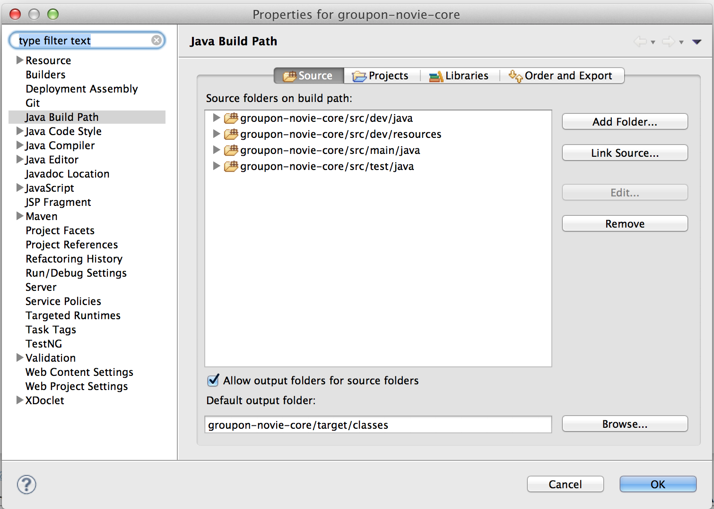
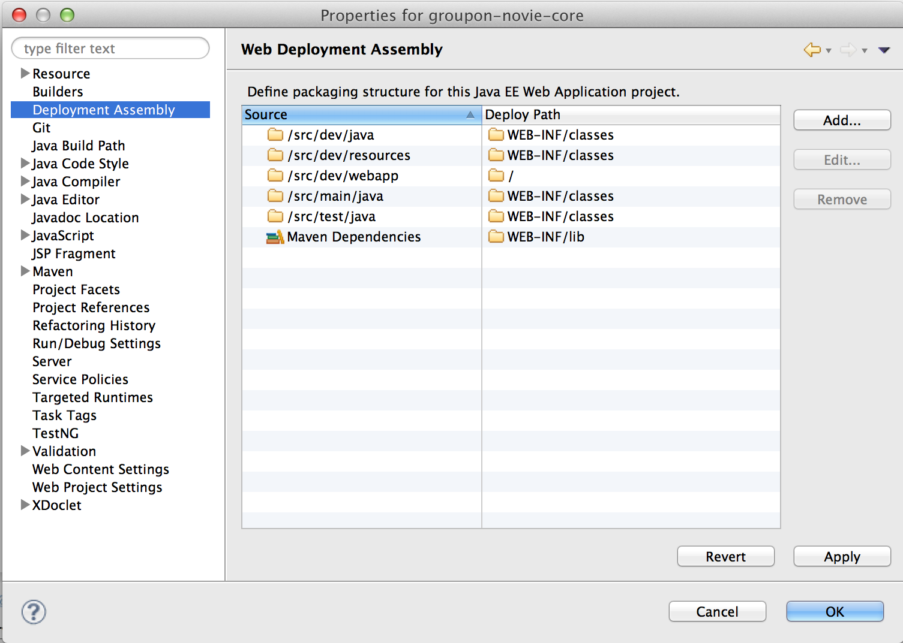

Novie
=====

Novie is a library desined to allow everybody to retrieve data from any RDBMS using HTTP.
It is primarily designed to retrieve data from any star or snowflake schema and return the result dataset in JSON, CSV or XML.

Its advanced querying system allows the user to retrieve, group, filter and sort any data exposed through Novie by using simple HTTP request.

    http://myapp/reporting/sales?date=[2013-01-01&date=2013-03-31]&group=state&sort=grossAmount

which returns for instance

    {
    	total: 3,
		summary: {
				grossAmount: 649272.45,
				saleCount: 81377,
			},
		records: [
			{
			group: [
				{
					_display: "California (CA)",
					informations: {
						Name: "California",
						Code: "CA"
						}
					}
				],
			measures: {
				grossAmount: 64934,
				saleCount: 9045,
				}
			},
			{
			group: [
				{
					_display: "Texas (TX)",
					informations: {
						Name: "Texas",
						Code: "TX"
						}
					}
				],
			measures: {
				grossAmount: 59334,
				saleCount: 5045,
				}
			},
			...
    }

Roadmap
-------
Currently Novie is a Java library designed to be integrated into a web application. The main steps currently planned in its roadmap are
- Improve the query system
    - Support filtering on the measures
    - Support multiple schema
    - Support configuration of visibility of the information (for querying and/or displaying)
- Support configuration using XML files
- Support Table/child type schema
- Deliver a standalone webapp, which can be deployed and configured without a line of code

Usage
-----

Once an endpoint is defined, the user can make a HTTP query to retrieve the data.

Each url is composed of :
- The end point which is different for every set of measure
- Set of constraint parameters
- The grouping parameters
- Eventually a set of extra parameters such as: sorting, paging or timezone switching.

`http://xxxxx/xxxx/xxx/endPoint?dimension.info=[val1&dimension.info=val2&dimension2.info1=val3&group=dimension2&sort=-dimension2.info`

For more details, please read the querying documentation [here](./docs/querying.md).

Development & Integration
-------------------------

### Integration in a web-app
Novie is currently designed to be integrated in a Spring web-app and configured using Spring beans.

In the web-app 2 beans must be deploy.
- A `javax.sql.DataSource` named `novieDataSource`
- A `com.groupon.novie.SchemasLoader` named `novieSchemasLoader`

The implementation of `com.groupon.novie.SchemasLoader` is accountable to returns the list of schemas' definitions. The schema definition is represented by the interface `com.groupon.novie.SchemaDefinition` which have a concrete public implementation `com.groupon.novie.utils.SchemaDefinitionImpl` which can be used.
Each schema definition contains:
- The definition of the fact table and its measures.
- The definition of the dimensions and their informations.
- The definition of the relations between the fact table and the dimensions and between the dimensions in the case of a snowflake schema.
- The virtual dimension that can be substituted depending on the Timezone.

In the web.xml, the specific servlet must be configured and mapped.

	<servlet>
    	<servlet-name>novie</servlet-name>
    	<servlet-class>org.springframework.web.servlet.DispatcherServlet</servlet-class>
    	<init-param>
      		<param-name>contextClass</param-name>
      		<param-value>
            	org.springframework.web.context.support.AnnotationConfigWebApplicationContext
       		</param-value>
    	</init-param>
    	<init-param>
      		<param-name>contextConfigLocation</param-name>
      		<param-value>com.groupon.novie.NovieConfig</param-value>
    	</init-param>
    	<load-on-startup>1</load-on-startup>
	</servlet>

### Development environment

To build Novie simply run `mvn clean install`

To run the integration tests (see below), run `run clean verify -Pintegration-test`

#### Developement of Novie-core

A special maven profile `dev-web` is configured. This will allow you to deploy run a simple web-app which contains one end-point base on a hsqldb DB. In a near future, this database will also be used for automated tests.

A set of junit test are also present (test coverage will improve in subsequent releases).

**Tip:**
In eclipse, in order to deploy the project, you have to:
- enable the "Dynamic Web Module" project facet.
- configure `src/dev/java` and `src/dev/resources` to be part of the build path.
- configure the `Deployment Assembly` to include the `dev/` folders.

*"Build path" configuration*

*"Deployment Assembly" configuration*

**Tip**
In IntelliJ, just select the profile `dev-web` and deploy it in tomcat.

#### Developement of Novie-qa

`Novie-qa`is a module which includes all the integration tests using [cucumber](http://cukes.info/). The special
maven profile `integration-test` start a HSQLDB server, a tomcat server and deploy inside a simple webapp which
configure the Novie to use a test start-schema.

To develop new integration test, the easiest way is to simulate the mvn environment. To help
with that a "Main" class `com.groupon.novie.integrationtest.DebugHSQLDB` is provided. This class starts a HSQLDB server
and runs the SQL script to create the schema. To test/develop the integration test you must:
- Run com.groupon.novie.integrationtest.DebugHSQLDB
- Run a tomcat server, on port 9090, with the "test app", provided by the profile `integration-test` deployed. It works exactly as for the development environment.

License
-------
This project is under BSD 3-Clause license
